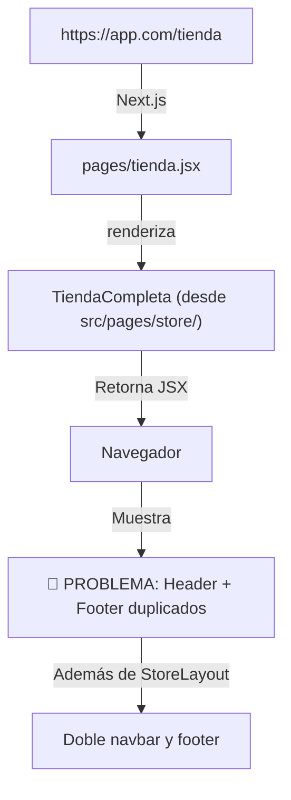
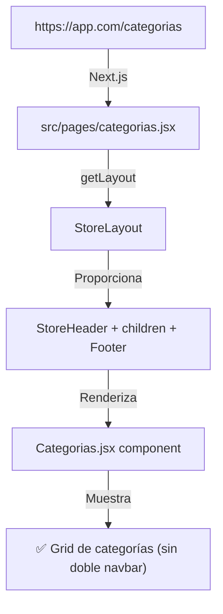
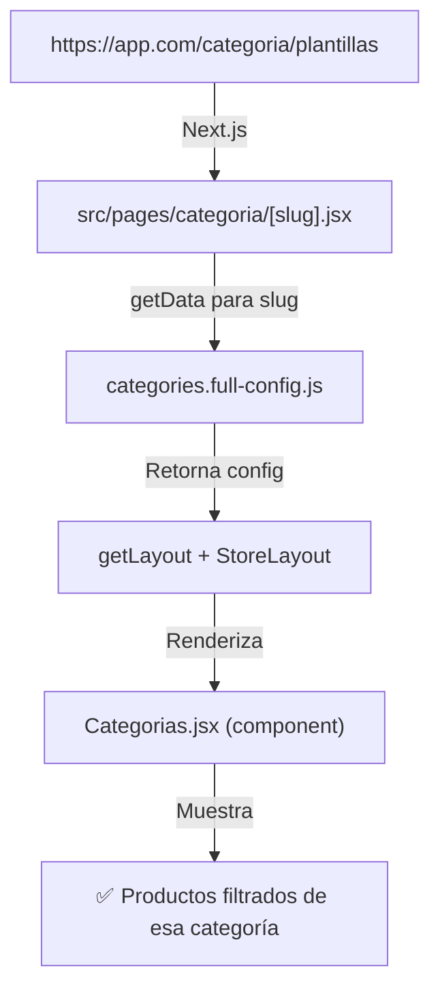
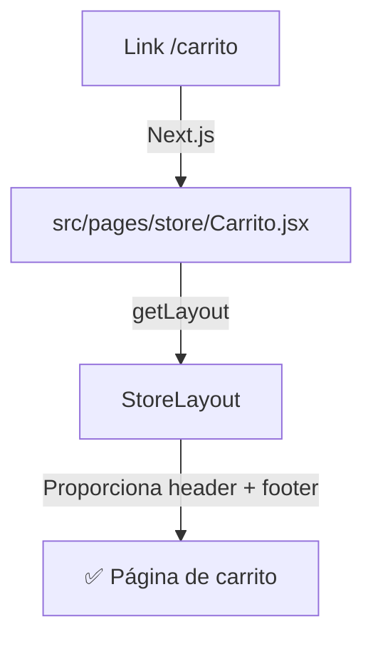

# 📋 ARQUITECTURA COMPLETA DE LA TIENDA - Ortopedia Cuernavaca

**Documento de fecha:** Octubre 21, 2025  
**Rama:** `recover/wip-2025-10-17`  
**Estado:** En consolidación (duplicados identificados)

---

## 🎯 RESUMEN EJECUTIVO

La tienda de Ortopedia Cuernavaca está distribuida en **múltiples capas**:

1. **Entry Points** (páginas raíz en `/pages/`)
2. **Componentes de Tienda** (en `/src/pages/store/` y `/src/pages/categoria/`)
3. **Layouts** (Header, Footer, MarketingLayout, StoreLayout)
4. **Datos** (archivos de configuración y productos)
5. **Controles** (routing, filtrado, estado)

**Problema identificado:** Existe **duplicación de headers y footers** en TiendaCompleta.jsx que debe consolidarse en StoreLayout.

---

## 📁 ESTRUCTURA DE CARPETAS

```
PROYECTO ROOT
│
├── pages/                                  # Entry points raíz (Next.js)
│   ├── tienda.jsx                         # ✅ ENTRADA: renderiza TiendaCompleta con Head/SEO
│   ├── tienda-simple.jsx                  # FALLBACK: renderiza Tienda.jsx (antiguo)
│   ├── categorias.jsx                     # ✅ ENTRADA: página de categorías (root)
│   ├── carrito.jsx                        # (Redirige a /src/pages/store/Carrito.jsx)
│   ├── [productId].jsx                    # Dynamic: detalles de producto
│   └── ...
│
├── src/
│   ├── pages/
│   │   ├── store/
│   │   │   ├── TiendaCompleta.jsx         # 🔴 PROBLEMA: header + footer incrustados
│   │   │   ├── Tienda.jsx                 # Component que usa Layout (antiguo)
│   │   │   ├── Carrito.jsx                # Page de carrito con nav incrustada
│   │   │   └── Producto.jsx               # Page de detalle de producto
│   │   │
│   │   ├── categoria/
│   │   │   ├── [slug].jsx                 # ✅ NUEVO: dynamic route para categorías
│   │   │   ├── Categorias.jsx             # Component: grid de categorías (sin layout)
│   │   │   ├── plantillas.jsx
│   │   │   ├── fajas.jsx
│   │   │   ├── ortesis.jsx
│   │   │   ├── calzado.jsx
│   │   │   ├── pediatria.jsx
│   │   │   └── rehabilitacion.jsx
│   │   │
│   │   ├── home/
│   │   │   ├── Home.jsx                   # Component
│   │   │   ├── Citas.jsx
│   │   │   ├── Contacto.jsx
│   │   │   └── Nosotros.jsx
│   │   │
│   │   ├── services/
│   │   │   └── Servicios.jsx
│   │   │
│   │   ├── _app.jsx                       # App wrapper con getLayout
│   │   ├── index.jsx                      # Home page
│   │   └── ...
│   │
│   ├── components/
│   │   └── layout/
│   │       ├── Layout.jsx                 # Old layout (deprecated)
│   │       ├── Header.jsx                 # ❌ Marketing header (no se usa en store)
│   │       ├── MarketingHeader.jsx        # Header para páginas de marketing
│   │       ├── MarketingLayout.jsx        # Layout: MarketingHeader + children + Footer
│   │       ├── StoreHeader.jsx            # ✅ NEW: Store header (para tienda)
│   │       ├── StoreLayout.jsx            # ✅ Layout: StoreHeader + children + Footer
│   │       └── Footer.jsx                 # Footer compartido
│   │
│   ├── data/
│   │   ├── categories.config.js           # Array de categorías (para UI)
│   │   ├── categories.full-config.js      # Object de categorías (para routes)
│   │   └── products.config.js             # Datos de productos (optional)
│   │
│   └── features/
│       └── store/
│           └── TiendaCompleta.jsx         # (COPIA: duplicada en /src/pages/store/)
│
└── public/
    ├── images/
    │   ├── banners/
    │   │   ├── Banner Tienda 1.png
    │   │   ├── LogoOrtochavitos.svg
    │   │   └── ... (otros banners)
    │   └── products/
    │       └── ... (imágenes de productos)
    └── ... (otros assets)
```

---

## 🔀 FLUJO DE ROUTING Y CONEXIONES

### **A. ENTRADA A LA TIENDA**

#### Escenario 1: Usuario accede a `/tienda`



**Archivo:** `pages/tienda.jsx`
```jsx
import TiendaCompleta from '../src/pages/store/TiendaCompleta';

export default function TiendaPage() {
  return (
    <>
      <Head>...</Head>
      <TiendaCompleta />  // Renderiza directamente (sin StoreLayout)
    </>
  );
}
```

**Estado actual de TiendaCompleta.jsx:**
- Líneas 1040-1175: `<div className="hidden">` (Top Bar + Main Header - oculto)
- Líneas 1878-2050: `<div className="hidden">` (Footer - oculto)
- Línea 200-1700: Contenido principal (navegación, productos, etc.)

---

#### Escenario 2: Usuario accede a `/categorias`



**Archivo:** `src/pages/categorias.jsx`
```jsx
export default function CategoriasPage() {
  return (
    <>
      <Head>...</Head>
      {/* LIMPIO: solo contenido, sin header */}
      <section>...</section>
    </>
  );
}

CategoriasPage.getLayout = (page) => <StoreLayout>{page}</StoreLayout>;
```

---

#### Escenario 3: Usuario accede a `/categoria/plantillas` (dynamic)



---

### **B. ACCESO AL CARRITO**



---

## 🏗️ COMPONENTES PRINCIPALES Y SUS RESPONSABILIDADES

### **1. LAYOUTS (Estructura)**

#### `StoreLayout.jsx` ✅ (Correcto - Nueva consolidación)
```jsx
// Proporciona:
// - StoreHeader (con logo, búsqueda, carrito, wishlist)
// - Main content area
// - Footer (compartido)
// - Estado local: searchTerm, showWishlistOnly, wishlist

// Usado por:
// - /tienda (vía pages/tienda.jsx?)
// - /categorias
// - /carrito
// - /categoria/[slug]
```

**Props:**
- `children`: contenido de la página
- Estados internos: `searchTerm`, `setSearchTerm`, `showWishlistOnly`, `setShowWishlistOnly`, `wishlist`

---

#### `MarketingLayout.jsx` ✅ (Correcto - Para páginas de marketing)
```jsx
// Proporciona:
// - MarketingHeader (navegación principal + logo)
// - Main content area
// - Footer (compartido)

// Usado por:
// - src/pages/servicios.jsx (vía getLayout)
// - src/pages/home/Home.jsx
// - Otros servicios y blog
```

---

#### `Header.jsx` ❌ (NO USAR EN STORE)
- Es el `MarketingHeader` (viejo nombre)
- Usada en navegación global
- Tiene todas las categorías de tienda como dropdown
- NO debe usarse directamente en páginas de tienda

---

### **2. COMPONENTES DE TIENDA**

#### `TiendaCompleta.jsx` 🔴 (PROBLEMA)
**Ubicación:** `src/pages/store/TiendaCompleta.jsx`

**Contiene:**
- Carrusel de banners
- Sección de servicios destacados
- Grid de categorías
- Sección "Centro Integral de Rehabilitación"
- PROBLEMA: Header y footer ocultos (className="hidden")

**Issue actual:**
```jsx
// Líneas 1040-1175: Header incrustado (oculto)
<div className="hidden">
  <div>Top Bar...</div>
  <header>Main Header...</header>
</div>

// Líneas 1878-2050: Footer incrustado (oculto)
<div className="hidden">
  <footer>...</footer>
</div>
```

**Solución recomendada:**
- ❌ Eliminar completamente los bloques ocultos
- ✅ Reliar en `StoreLayout` para header/footer
- ✅ Usar `/tienda` con `getLayout = (page) => <StoreLayout>{page}</StoreLayout>`

---

#### `Tienda.jsx` (Componente antiguo - deprecated)
**Ubicación:** `src/pages/store/Tienda.jsx`

- Usa el viejo `Layout` (deprecated)
- Solo renderiza una sección de "Productos Destacados"
- NO está siendo usado (existe `tienda-simple.jsx` que sí lo usa)

---

#### `Carrito.jsx`
**Ubicación:** `src/pages/store/Carrito.jsx`

- Renderiza:
  - Nav de categorías (hardcoded)
  - Grid de items en carrito
  - Resumen de compra
  - Métodos de pago

**Debe tener `getLayout`:**
```jsx
Carrito.getLayout = (page) => <StoreLayout>{page}</StoreLayout>;
```

---

#### `Producto.jsx`
**Ubicación:** `src/pages/store/Producto.jsx`

- Detalle de un producto individual
- Grid de productos relacionados
- Nav de categorías (hardcoded)

**Debe tener `getLayout`:**
```jsx
Producto.getLayout = (page) => <StoreLayout>{page}</StoreLayout>;
```

---

### **3. PÁGINAS DE CATEGORÍAS**

#### `[slug].jsx` ✅ (Dynamic route NUEVO)
**Ubicación:** `src/pages/categoria/[slug].jsx`

```jsx
export async function getStaticProps({ params }) {
  const { slug } = params;
  const category = categoriesFullConfig[slug]; // De categories.full-config.js
  return { props: { category }, revalidate: 3600 };
}

export async function getStaticPaths() {
  const paths = Object.keys(categoriesFullConfig).map(slug => ({
    params: { slug }
  }));
  return { paths, fallback: 'blocking' };
}
```

**Renderiza:** `Categorias.jsx` (componente)

---

#### `Categorias.jsx` (Componente - sin layout)
**Ubicación:** `src/pages/categoria/Categorias.jsx`

- Recibe props del `[slug].jsx`
- Renderiza grid de categorías o productos
- NO tiene layout incrustado (usa el de getLayout)

---

#### Páginas específicas: `plantillas.jsx`, `fajas.jsx`, etc.
- Renderizaciones específicas por categoría
- Algunas pueden ser simplemente aliases

---

## 🔗 MATRIZ DE FLUJO (Quién llama a quién)

| **Entrada** | **Router** | **Componente** | **Layout** | **Headers** | **Footer** |
|---|---|---|---|---|---|
| `/` | `pages/index.jsx` | `Home.jsx` | `MarketingLayout` | MarketingHeader | Footer |
| `/tienda` | `pages/tienda.jsx` | `TiendaCompleta.jsx` | ❌ NINGUNO | 🔴 Incrustado | 🔴 Incrustado |
| `/tienda-simple` | `pages/tienda-simple.jsx` | `Tienda.jsx` | `Layout` (old) | ❌ Ninguno | ❌ Ninguno |
| `/categorias` | `src/pages/categorias.jsx` | Inline content | ✅ `StoreLayout` | StoreHeader | Footer |
| `/categoria/plantillas` | `src/pages/categoria/[slug].jsx` | `Categorias.jsx` | ✅ `StoreLayout` | StoreHeader | Footer |
| `/carrito` | `src/pages/store/Carrito.jsx` | Inline + nav | ❌ NINGUNO | 🔴 Hardcoded | ❌ Ninguno |
| `/producto/[id]` | `src/pages/store/Producto.jsx` | Inline + nav | ❌ NINGUNO | 🔴 Hardcoded | ❌ Ninguno |
| `/servicios` | `pages/servicios.jsx` | `Servicios.jsx` | `MarketingLayout` | MarketingHeader | Footer |
| `/nosotros` | `pages/nosotros.jsx` | Content | `MarketingLayout` | MarketingHeader | Footer |

---

## 📊 ESTADO DE CONSOLIDACIÓN (ANTES → DESPUÉS)

### **ANTES (Actual - Problema)**

```
/tienda
  ↓
TiendaCompleta.jsx (MONOLÍTICO)
  ├── 🔴 Header (oculto - hidden div)
  ├── 🔴 Footer (oculto - hidden div)
  ├── Contenido
  └── TODO en 1 archivo (2000+ líneas)

/categorias
  ↓
categorias.jsx
  ├── StoreLayout
  ├── Categorias.jsx (component)
  └── ✅ Correcto

/carrito
  ↓
Carrito.jsx
  ├── 🔴 Nav hardcoded
  ├── 🔴 SIN Layout
  └── Contenido
```

### **DESPUÉS (Objetivo - Correcto)**

```
/tienda
  ↓
pages/tienda.jsx (con getLayout)
  ↓
StoreLayout
  ├── StoreHeader
  ├── TiendaCompleta (componente LIMPIO, sin header/footer)
  └── Footer

/categorias
  ↓
src/pages/categorias.jsx (con getLayout)
  ↓
StoreLayout
  ├── StoreHeader
  ├── Categorias.jsx
  └── Footer

/carrito
  ↓
src/pages/store/Carrito.jsx (con getLayout)
  ↓
StoreLayout
  ├── StoreHeader
  ├── Carrito content
  └── Footer
```

---

## 📦 DATOS Y CONFIGURACIÓN

### **`categories.config.js`**
```javascript
// Array para UI (front-end)
export const categoriesConfig = [
  { id: 1, name: 'Plantillas', slug: 'plantillas', ... },
  { id: 2, name: 'Fajas', slug: 'fajas', ... },
  ...
];
```

**Usado por:**
- `src/pages/categorias.jsx` (grid de categorías)
- Filtros en tienda

---

### **`categories.full-config.js`**
```javascript
// Object para routes dinámicas
export const categoriesFullConfig = {
  plantillas: { id: 1, name: 'Plantillas', ... },
  fajas: { id: 2, name: 'Fajas', ... },
  ...
};
```

**Usado por:**
- `src/pages/categoria/[slug].jsx` (getStaticProps)

---

### **`products.config.js`**
- Opcional: datos de productos
- Actualmente no se usa (hardcoded en TiendaCompleta)

---

## 🎛️ CONTROLES Y ESTADO

### **State Management (Actual - Local)**

Cada componente maneja su propio estado:

```javascript
// En TiendaCompleta
const [categoriaActiva, setCategoriaActiva] = useState('todos');
const [searchTerm, setSearchTerm] = useState('');
const [wishlist, setWishlist] = useState([]);
const [sortBy, setSortBy] = useState('default');

// En StoreLayout
const [searchTerm, setSearchTerm] = useState('');
const [showWishlistOnly, setShowWishlistOnly] = useState(false);
const [wishlist, setWishlist] = useState([]);
```

**Problema:** Está duplicado en StoreLayout y TiendaCompleta.

**Solución futura:**
- Considerar Context API o Zustand para compartir estado global
- Sincronizar búsqueda y wishlist entre componentes

---

### **Filtrado de Productos (en TiendaCompleta)**

```javascript
const getFilteredAndSortedProducts = () => {
  let products = productosPorCategoria[categoriaActiva] || [];
  
  // Filtrar por búsqueda
  if (searchTerm) {
    products = products.filter(p => 
      p.description.toLowerCase().includes(searchTerm.toLowerCase())
    );
  }
  
  // Filtrar solo wishlist si está activado
  if (showWishlistOnly) {
    products = products.filter(p => wishlist.includes(p.id));
  }
  
  // Ordenar
  switch (sortBy) {
    case 'price-low': return products.sort(...);
    case 'price-high': return products.sort(...);
    case 'name': return products.sort(...);
    default: return products;
  }
};
```

---

## 🚨 PROBLEMAS IDENTIFICADOS

### **1. DUPLICACIÓN DE HEADERS/FOOTERS**

**Dónde:**
- `src/pages/store/TiendaCompleta.jsx` (oculto con `className="hidden"`)
- `src/pages/store/Carrito.jsx` (navegación hardcoded)
- `src/pages/store/Producto.jsx` (navegación hardcoded)

**Impacto:**
- Mantenimiento difícil
- Inconsistencias visuales
- Cambios requieren múltiples ediciones

**Solución:**
- ✅ Usar `StoreLayout` para todas las páginas de tienda
- ✅ Remover los bloques ocultos/hardcoded
- ✅ Aplicar `getLayout` pattern

---

### **2. FALTA DE GETLAYOUT EN ALGUNAS PÁGINAS**

**Problemas:**
- `/tienda` → No tiene `getLayout` (renderiza TiendaCompleta directamente)
- `/carrito` → No tiene `getLayout`
- `/producto/[id]` → No tiene `getLayout`

**Solución:**
```jsx
// En cada página
YourPage.getLayout = (page) => <StoreLayout>{page}</StoreLayout>;
```

---

### **3. NAVEGACIÓN HARDCODEADA**

**Ubicaciones:**
- Carrito.jsx: `<nav>` hardcoded
- Producto.jsx: `<nav>` hardcoded
- TiendaCompleta.jsx: `<nav>` hardcoded (línea ~200)

**Solución:**
- Extraer a componente `<StoreNavigation />`
- O usar el nav que viene de StoreLayout

---

### **4. ESTADO DUPLICADO EN STORELAYOUT Y TIENDACOMPLETA**

**Problema:**
- `searchTerm`, `wishlist`, etc. están en ambos lugares
- No se sincronizan entre componentes

**Solución:**
- Pasar estado como props desde StoreLayout a TiendaCompleta
- O usar Context API para estado global

---

### **5. ESTRUCTURA MONOLÍTICA DE TIENDACOMPLETA**

**Líneas:** ~2000 líneas en 1 archivo

**Contiene:**
- Carrusel
- Sección de servicios
- Grid de categorías
- Productos destacados
- Todas las nav y filtros

**Solución futura:**
- Dividir en componentes más pequeños:
  - `HeroCarousel.jsx`
  - `CategoryGrid.jsx`
  - `ProductGrid.jsx`
  - `RehabilitationSection.jsx`

---

## ✅ CHECKLIST DE CONSOLIDACIÓN

- [x] Crear `StoreHeader.jsx` (extraído de TiendaCompleta)
- [x] Crear/actualizar `StoreLayout.jsx` (incluir StoreHeader)
- [x] Actualizar `src/pages/categorias.jsx` (aplicar getLayout)
- [x] Ocultar header/footer en TiendaCompleta (con className="hidden")
- [ ] Eliminar completamente los bloques ocultos en TiendaCompleta
- [ ] Agregar `getLayout` a `pages/tienda.jsx`
- [ ] Agregar `getLayout` a `src/pages/store/Carrito.jsx`
- [ ] Agregar `getLayout` a `src/pages/store/Producto.jsx`
- [ ] Remover navegación hardcoded de Carrito.jsx
- [ ] Remover navegación hardcoded de Producto.jsx
- [ ] Sincronizar estado de búsqueda entre componentes (Context/Zustand)
- [ ] Dividir TiendaCompleta en componentes más pequeños
- [ ] Testear todas las rutas: /tienda, /categorias, /categoria/*, /carrito

---

## 🔍 ARCHIVOS CLAVE A REVISAR

1. **`pages/tienda.jsx`** ← Entry point actual
2. **`src/pages/store/TiendaCompleta.jsx`** ← 🔴 Problema principal
3. **`src/pages/categorias.jsx`** ← ✅ Modelo correcto
4. **`src/components/layout/StoreLayout.jsx`** ← Nuevo consolidador
5. **`src/components/layout/StoreHeader.jsx`** ← Nuevo header reutilizable
6. **`src/data/categories.config.js`** ← Datos de categorías

---

## 📝 RESUMEN FINAL

### Arquitectura Actual (Caótica)
- Múltiples headers en múltiples archivos
- Footers duplicados
- Falta de patrón consistente en layouts
- Estado fragmentado

### Arquitectura Objetivo (Limpia)
- **Un único StoreLayout** para todas las páginas de tienda
- **Un único StoreHeader** reutilizable
- **Un único Footer** compartido
- **Estado centralizado** en StoreLayout o Context
- **getLayout pattern** consistente en todas las páginas

### Beneficios
✅ Mantenimiento más fácil  
✅ Cambios visuales en un solo lugar  
✅ Rendimiento mejorado (componentes reutilizables)  
✅ Experiencia de usuario consistente  
✅ Código más limpio y DRY  

---

**Fin de documento**
